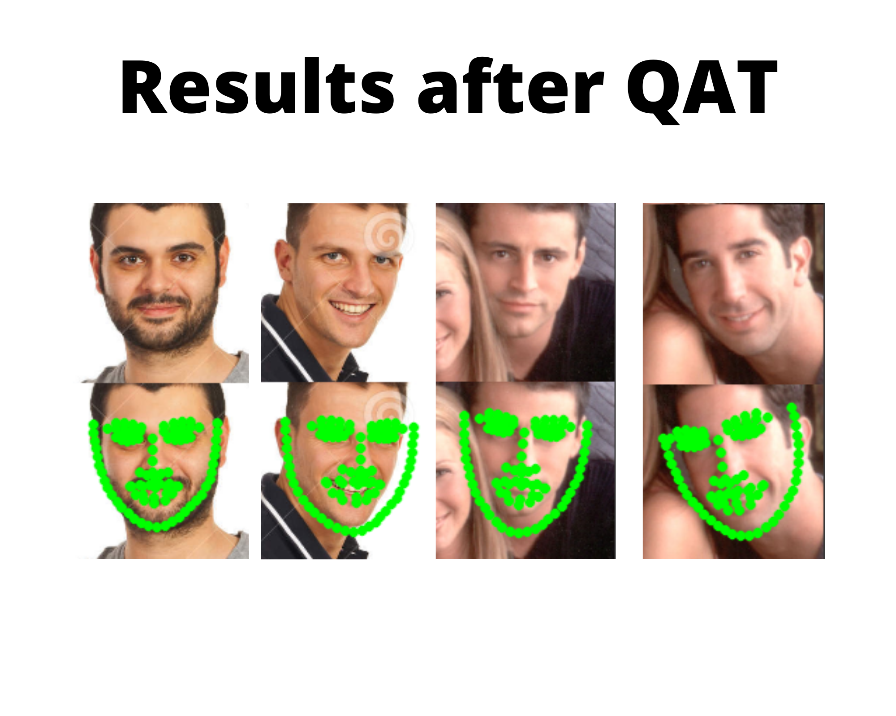

# fynd-facial-keypoint-detection

Facial Keypoint detection, trained with CNN model on WFLW Facial Keypoint Dataset and finetuned with Quantization Aware Training. The repo includes Post Training Quantization with Tensorflow's TfLite Converter and comparison with various PTQ techniques. Code in this repo is inspired from [yinguobing/facial-landmark-detection-hrnet](https://github.com/yinguobing/facial-landmark-detection-hrnet) and [cnn-facial-landmark](https://github.com/yinguobing/cnn-facial-landmark), and quantization concepts were covered from [paper](https://arxiv.org/pdf/2106.08295.pdf.)

Some of the results: 
## Getting Started
### Quickstart
Check out the colab notebook for setting up environment, training, prediction inferencing etc.

[](https://colab.research.google.com/drive/1GYu-SvQYqhCd2CWj64J6kDuMV9_xep27?usp=sharing)

### Installing

Just git clone this repo and you are good to go.

```bash
git clone https://github.com/keshav47/cnn-facial-landmark.git
```

## Prparing Dataset
Model is trained on WFLW Facial Keypoint Dataset

| Name        | Author                                                                                                         | Published | #Marks | #Samples |
| ----------- | -------------------------------------------------------------------------------------------------------------- | --------- | ------ | -------- |
| WFLW        | [Tsinghua National Laboratory](https://wywu.github.io/projects/LAB/WFLW.html)                                  | 2018      | 98     | 10000    |

Download the following files and place it inside the `./wflw_data` folder: 
1) [WFLW_annotations.tar.gz](https://drive.google.com/file/d/1-1NqSgYx55cZCUYWGDDiiTGeT6_BN57S/view?usp=sharing)
2) [WFLW_images.tar.gz](https://drive.google.com/file/d/1-1UlzCvhCYOr1bpIWZ9YeQExKN-igXgS/view?usp=sharing) 

The following command creates train and test records in `./tfrecords` folder.
```bash
# From the repo's root directory
!python generate_mesh_dataset.py
```
## Train & Finetune

The following command shows how to train the model for 10 epochs.

```bash
# From the repo's root directory, saved checkpoints stored in './checkpoints' directory
python3 landmark.py \
    --train_record=train.record \
    --val_record=validation.record \
    --batch_size=32 \
    --epochs=10
```

The following command shows how to finetune the model for 10 epochs.

```bash
# From the repo's root directory, saved checkpoints stored in './quantized_checkpoints' directory
python3 landmark.py \
    --train_record=train.record \
    --val_record=validation.record \
    --batch_size=32 \
    --epochs=10 \
    --quantization=True
```


## Export

TensorFlow's [SavedModel](https://www.tensorflow.org/guide/saved_model) is recommended and is the default option. Use the argument `--export_only` to save the model in '.pb' format.

```bash
# From the repo's root directory, This will save model trained without QAT to './exported' directory
python3 landmark.py --export_only=True
```

```bash
# From the repo's root directory, This will save model finetuned with QAT to './exported_quantized' directory
python3 landmark.py --export_only=True --quantization=True
```
### Result Inferencing Module
The inferecing module uses a pretrined face detector module, which predict bounding boxes of faces in an image and our keypoint detection algorithm then predicts keypoint for the bounding boxes.

```bash
from predict import predictor
# Run inference on trained model without QAT
predict = predictor('/content/fynd-facial-keypoint-detection/assets/face_model','/content/fynd-facial-keypoint-detection/exported')
predict.predict("./test_images/test_1.jpg")
predict.predict("./test_images/test_2.jpg")
predict.predict("./test_images/test_3.jpg")


# Run inference on trained model with QAT
quantized_predict = predictor('/content/fynd-facial-keypoint-detection/assets/face_model','/content/fynd-facial-keypoint-detection/exported_quantized')
quantized_predict.predict("./test_images/test_1.jpg")
quantized_predict.predict("./test_images/test_2.jpg")
quantized_predict.predict("./test_images/test_3.jpg")
```

### Post Training Quantization and its impact on Latency and Speed

Tensorflow's [TfLite converter](https://www.tensorflow.org/model_optimization/guide/quantization/training_example#create_quantized_model_for_tflite_backend) is used to convert '.pb' model to '.tflite'.


Post Training Quantization on Trained Model w/o QAT

| PTQ        | MSE                                                                                                         | Speed | 
| ----------- | -------------------------------------------------------------------------------------------------------------- | --------- |
| DynamicRangeQuantization | 11.48 | 141.92s |
| IntegerWithFloatFallback | 125.15491539955138 | 141.92030382156372s |
| IntegerOnly | 11.484367706775664 | 84.51638507843018s |
| FP16 | 11.429764971733093 | 2.5578582286834717s |
| 16x8 | 11.484367706775664 | 83.58727502822876s |


Post Training Quantization on Trained Model with QAT
| PTQ        | MSE                                                                                                         | Speed | 
| ----------- | -------------------------------------------------------------------------------------------------------------- | --------- |
| DynamicRangeQuantization | 7.693058376312256 | 2.1737828254699707s |
| IntegerWithFloatFallback | 134.4890119934082 | 141.91820645332336s |
| IntegerOnly | 7.693058376312256 | 2.1956045627593994s |
| FP16 | 7.693058376312256 | 2.5590295791625977s |
| 16x8 | 7.693058376312256 | 2.1480464935302734s |


Clear difference in MSE between model trained with QAT and without QAT clearly proves our hypothesis that QAT generates more robuts weights whose performance doesn't decrease post quantization.   

## SOURCES
